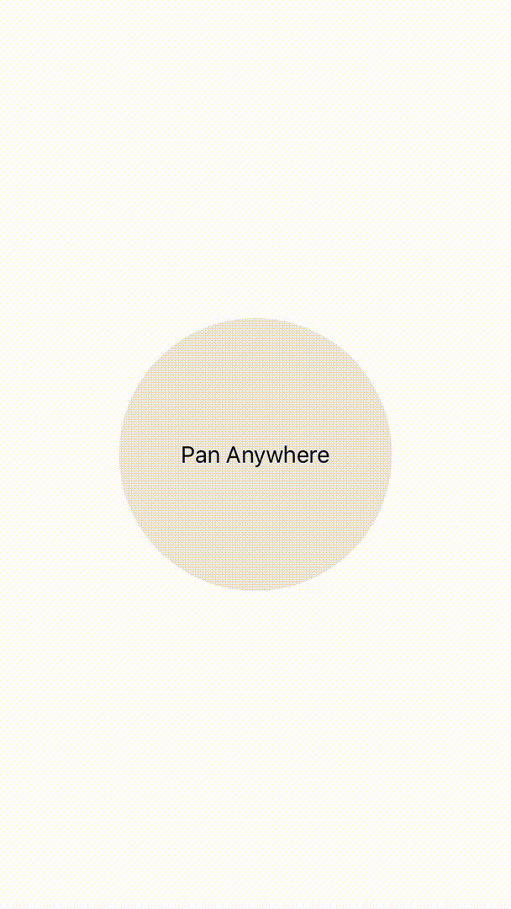

PanGestureView allows you to attach custom actions that will be triggered when the user pans the view. Think of it as a swipeable UITableViewCell, but as a generic UIView.

<p align="center">
    
</p>

### Installation

Install using cocoapods: `pod 'PanGestureView', '~> 0.1'`

### Usage:

Add an instance of PanGestureView as a subview in any of your views. Any other subviews you need can be added to the `contentView` of the PanGestureView.

Actions can be added as follows:

```
let action = PanGestureAction(swipeDirection: PanGestureViewSwipeDirection.Right, image: UIImage(named: ...)!)

// BG color of the actionView
action.backgroundColor = UIColor(...)

// Tint color of the provided UIImage. Images are automatically converted to their template versions using `imageWithRenderingMode(UIImageRenderingMode.AlwaysTemplate)`
action.tintColor = UIColor(...)

// Trigger handling
action.didTriggerBlock = {
    direction in
            
    // Handle action
    
}

panGestureView.addAction(action)
      
```  

One action per swipe direction is supported.

### License

PanGestureView is available under the MIT License.
